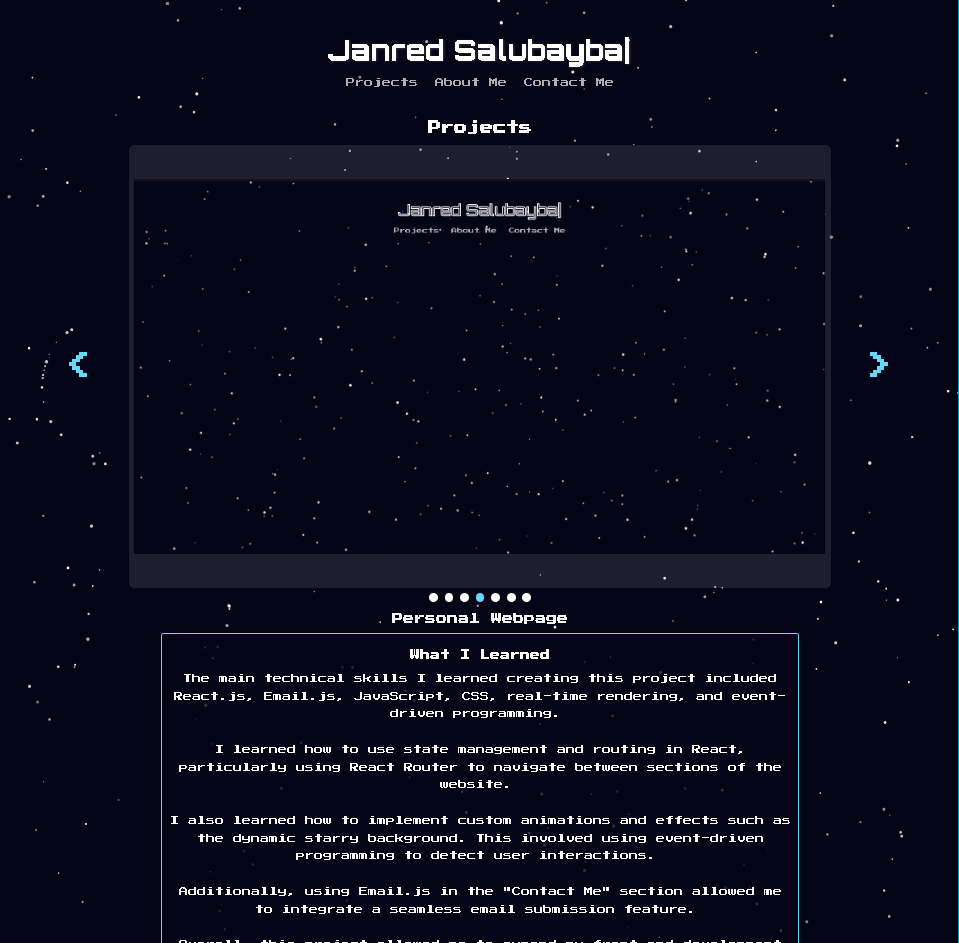
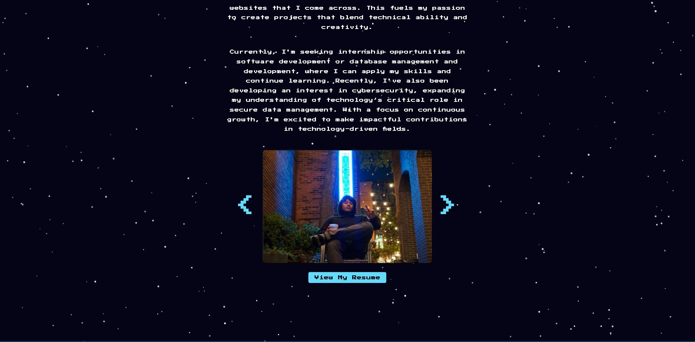
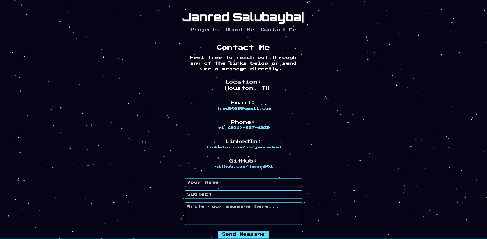

# 🌐 Personal Website  

A responsive portfolio website built using **React.js** to showcase my projects, experience, and skills. I wanted to build a small project that not only highlights my abilities through the website itself but also serves as a platform to showcase the other projects I've been working on. It also provides a way for people to reach out to me and learn a little more about who I am. This website features modern web design, animations, and interactive elements to enhance user engagement and provide a structured portfolio.

**🔗 Deployed Website**  
[View the live website](https://janny801.github.io/personal-website)


## 🧪 Local Development & Deployment

### Start Locally  
```bash
npm install      # Install all dependencies
npm start        # Runs the app in development mode at http://localhost:3000/
```

### Deploy to GitHub Pages  
```bash
npm run deploy
```

- This command automatically runs `npm run build` to create a production-ready build of the app.  
- Then it pushes the build output to the `gh-pages` branch for GitHub Pages deployment.  
- Make sure the `homepage` field in your `package.json` is correctly set:  
  - Example: `"homepage": "https://janny801.github.io/personal-website"`

## 🛠️ Technologies Used  
- **Frontend**: React.js, HTML, CSS  
- **Design & Styling**: Custom animations, responsive UI  

## 🖼️ Website Preview  

<div align="center"><h3><u>📸 Project Showcase</u></h3></div>

<p align="center">
  
</p>  

- A slideshow containing images of some projects I’ve worked on.  
- Includes what I learned, my experience building each project, and links to GitHub or the live website (if hosted).

<div align="center"><h3><u>📸 About Me Section</u></h3></div>

<p align="center">
  
</p>  

- Tells a little bit about myself and includes photos.  
- Includes a link to view my resume.

<div align="center"><h3><u>📸 Contact Section</u></h3></div>

<p align="center">
  
</p>  

- Offers multiple ways to get in touch with me — general location, email, phone numbers, LinkedIn, GitHub, and a form that sends an email directly to me via **EmailJS**.

